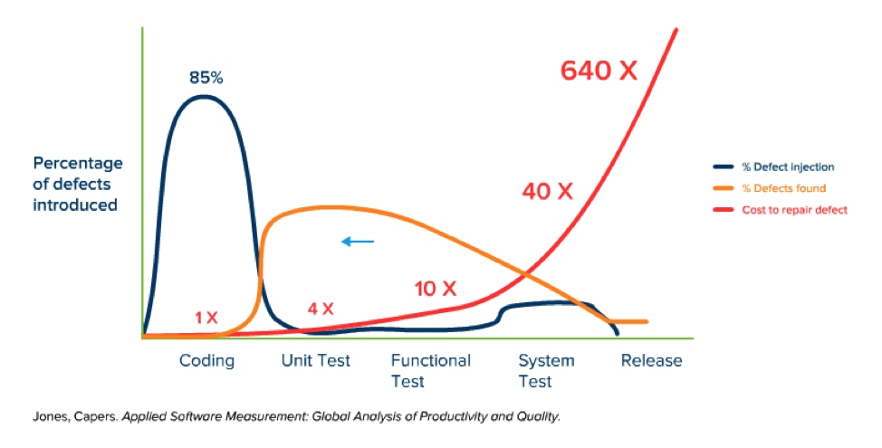

For many developers, design patterns are something they vaguely heard about. Like some dark technology only senior devs have to worry about.  
Junior devs mostly don't even know they exist.  
> Personnally, once I found out about design patterns, it took my skillset to the next level.  

It's very interesting to think about the design of a software or an app at a high level, then using well-defined implementations to translate a somehow abstract idea to very concrete code.

## Why do we use design pattern ?
The idea is very simple. Some issues are recurrent when you are developing a software or an app and there are better ways than other to address them.  
A design pattern is not code properly speaking, it's more of a template for how to solve a particular problem.  
Something tricky is, especially as a beginner, you won't be able to tell the benefits of using a specific pattern. Actually it's when an application grows and needs to be specific or address specific needs that you will encounter some issues that would never have existed if the design was "good" from the begining.  
As you may have guessed, it's very important to imagine how the application would grow to use effectively design patterns.  
At the beginning you would have the feeling you are losing time by encapsulating to much or using delegation where you don't feel you have to.   
But at the end of the day, once the application would grow and expend, you will congratulate yourself for being so careful.  

Most people in tech - or at least in management - know that it's expensive to maintain a software and fix the bugs:  

You are a valuable asset to your team and your company when you don't create hundreds of bugs each time you create a feature. Having - at least a basic - knowledge of some design patterns can't hurt.

An other advantage of using design patterns is to share common ground with more experienced developers. For instance, instead of describing step-by-step an algorithm you would use to solve a problem, just explain that you would use an observer pattern. It would make you look professional and avoid waist of time and as you should know, time is essence when it comes to software engineering.

## Example of design patterns
It exists lots of different patterns, classified in categories:  
>Behavioral, Creational and Structural patterns  

that tackle a specific kind of problem.
### Strategy pattern
Defines a family of algorithms, encapsulate each one, and make them interchangeable.  
You could also checkout [this link](../strategy-pattern/)

### Observer pattern
Defines a one-to-many dependency between objects so that when one of them changes, all of its dependents are __notified__ and __updated__ automatically.

You could also checkout [this link](../observer-pattern/)

### Decorator pattern 
You could also checkout [this link](../decorator-pattern/)

_This list would evolve with the different articles written_

## Lecture to get started
- If you don't want to invest right now in a paper book or kindle, you can get a grasp on many design patterns [there](https://sourcemaking.com)
- An other great reading is [Head First Design Patterns](https://www.amazon.fr/First-Design-Patterns-Elisabeth-Freeman/dp/0596007124), a free version is availabled [at this address](https://raw.githubusercontent.com/ajitpal/BookBank/master/%5BO%60Reilly.%20Head%20First%5D%20-%20Head%20First%20Design%20Patterns%20-%20%5BFreeman%5D.pdf)

## To conclude - The key takeaways

- Design patterns address specific problems with well thought, high-level solutions
- It gives a common vocabulary to all team members and speed-up the necessary time for everyone to get what you are explaining
- They are classified in categories: Behavioral, Creational and Structural patterns
- When you get started, you definetely should know - and implement at least once - the [Strategy](../strategy-pattern/), [Observer](../decobserverorator-pattern/) or [Decorator](../decorator-pattern/) patterns
- And remember, practice makes perfect!

#### Any remarks ?
Make a [pull request!](!https://github.com/ackermannQ/quentinackermann)
Don't know how to do it ? Check out this [very well explained tutorial](https://opensource.com/article/19/7/create-pull-request-github)
