One of my hobbies is to build some proof-of-concept games.  
What does that mean?  
That I don't have the time to build full games since I'm mostly developing my skills as a full stack web engineer but I do like diversifying myself.

## Unity Engine

The [Unity Engine](https://unity.com/fr) is one of the most used game engine available today. Even though there are paying plans, a lot can be achieved with the free version. Besides, an asset store where a great number of decoration elements, sounds, scripts and more are available.
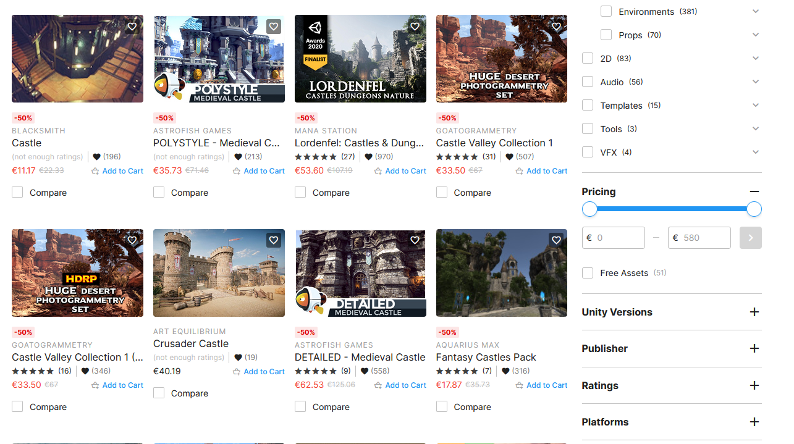

On the [Unity Learning Website](https://learn.unity.com/) a vast number of tutorials get you started.

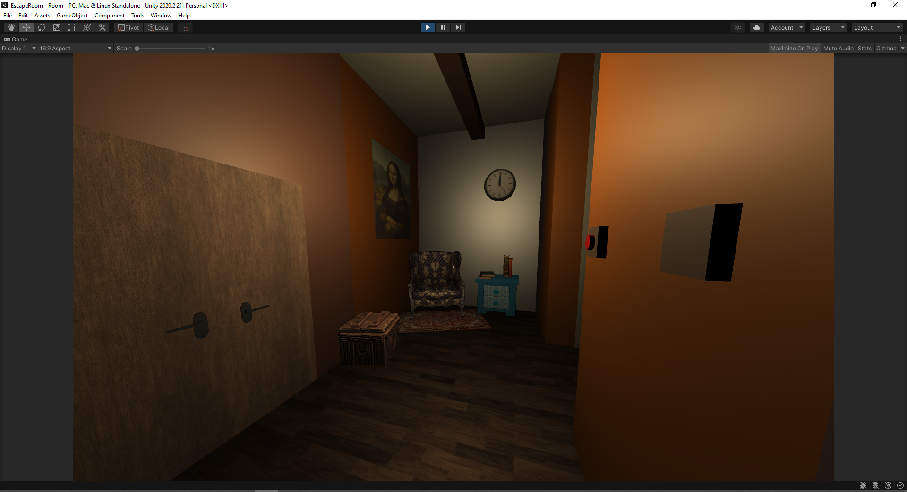

## Introduction

Currently I'm creating a nice Escape Room game in order to get acquainted with key concepts of game design.  
In this project I want to mainly focus on the player mechanics since it will rely on user interaction and observation of the game environment.

The design I imagined is simple:

- The player would have an `InteractionController` script that would be responsible for doing the interface between the **player** and the **interactable** component.
- All the interactable objects would inherit an `InteractableBase` class that would satisfy an `IInteractable` interface.
- Then, I would like the user to perform some basic actions like **Push**, **Observe**, **Destroy** or **Switch a light**...

## IInteractable

Let's start simply with the `IInteractable` interface:

```csharp
public interface IInteractable
{
   float HoldDuration { get; }
   bool HoldInteract { get; }
   bool MultipleUse { get; }
   bool IsInteractable { get; }

   void OnInteract();
}
```

The contract is clear, an interactable object should have the following characteristics:

- A `HoldDuration` float to determine how long should be pressed a button to realize the interaction;
- A `HoldInteract` boolean to know if the button to interact should be hold pressed;
- A `MultipleUse` boolean to know if multiple uses are possible;
- A `IsInteractable` boolean to know if the interactable is still interactable (unique interaction for instance);
- An `OnInteract` method.

## InteractableBase

The responsability of this class is to implement the element required from the `IInteractable` interface:

```csharp
using UnityEngine;

public class InteractableBase : MonoBehaviour, IInteractable
{
   [Header("Interactable Settings")]
   private float _holdDuration = 1f;

   [Space]
   private bool _holdInteract = true;

   private bool _multipleUse = false;

   private bool _isInteractable = true;

   private bool _deactivateInteraction = false;

   public float HoldDuration
   {
      get => _holdDuration;
      set => _holdDuration = value;
   }

   public bool HoldInteract => _holdInteract;
   public bool MultipleUse => _multipleUse;
   public bool IsInteractable => _isInteractable;

   public virtual void OnInteract()
   {
      Debug.Log("INTERACTED : " + gameObject.name);
   }
}
```

This code is straightforward, some [getters/setters](https://codeasy.net/lesson/properties) are used to access the private members of the class.  
By default, the hold duration is set to one second.

This base class will be extended to the possible actions.

## InputHandler

In order to interact with the objects, an input handler is necessary:

```csharp
using UnityEngine;

public class InputHandler : MonoBehaviour
{
   public InteractionInputData interactionInputData;

   void Start()
   {
      interactionInputData.ResetInput();
   }

   void Update()
   {
      GetInteractionInputData();
   }

   void GetInteractionInputData()
   {
      interactionInputData.InteractedClicked = Input.GetKeyDown(KeyCode.E);
      interactionInputData.InteractedReleased = Input.GetKeyUp(KeyCode.E);
   }
}
```

The `InteractionInputData` class allows to define the interactioin behavior.

## InteractionInputData

```csharp
using UnityEngine;

[CreateAssetMenu(fileName = "InteractionInputData", menuName = "InteractionSystem/InputData")]
public class InteractionInputData : ScriptableObject
{
   private bool m_interactedClicked;

   private bool m_interactedReleased;

   public bool InteractedClicked
   {
      get => m_interactedClicked;
      set => m_interactedClicked = value;
   }

   public bool InteractedReleased
   {
      get => m_interactedReleased;
      set => m_interactedReleased = value;
   }

   public void ResetInput()
   {
      m_interactedClicked = false;
      m_interactedReleased = false;
   }
}
```

This allows to use [ScriptableObject](https://docs.unity3d.com/Manual/class-ScriptableObject.html): which is a data container to save large amounts of data.This is usefull to reduce the memory usage by avoiding copies of values.

## InteractionData

```csharp
using UnityEngine;

[CreateAssetMenu(fileName = "InteractionData", menuName = "InteractionSystem/InteractionData")]
public class InteractionData : ScriptableObject
{
   private InteractableBase m_interactable;

   public InteractableBase Interactable
   {
      get => m_interactable;
      set => m_interactable = value;
   }

   public void Interact()
   {
      m_interactable.OnInteract();
      ResetData();
   }
   public bool IsSameInteractable(InteractableBase _newInteractable) => m_interactable == _newInteractable;
   public bool IsEmpty() => m_interactable == null;
   public void ResetData() => m_interactable = null;
}
```

Take a moment to understand how fit the different parts, because it's in the `InteractionController` that it would all come together.

## InteractionController

Before detailing the actions the player will be able to make, let's have a look at the controller. It would allow the user to interact with the interactable objects.

```csharp
using UnityEngine;

public class InteractionController : ShowAction
{
   [Header("Data")]
   public InteractionInputData interactionInputData;

   public InteractionData interactionData;

   [Space]
   [Header("Ray Settings")]
   public float rayDistance;
   public float raySphereRadius;
   public LayerMask interactableLayer;

   private Camera m_camera;

   private bool m_interacting;

   private float m_holdTimer = 0f;

   public float HoldTimer => m_holdTimer;

   public CircularLoading circularLoading;

   void Awake()
   {
      m_camera = FindObjectOfType<Camera>();
   }

   void Update()
   {
      CheckForInteractable();
      CheckForInteractableInput();
   }

   void CheckForInteractable()
   {
      var _ray = new Ray(m_camera.transform.position, m_camera.transform.forward);

      bool _hitSomething = Physics.SphereCast(_ray, raySphereRadius, out RaycastHit _hitInfo, rayDistance, interactableLayer);

      if (_hitSomething)
      {
         var _interactable = _hitInfo.transform.GetComponent<InteractableBase>();

         if (_interactable != null)
         {
            if (interactionData.IsEmpty())
            {
               interactionData.Interactable = _interactable;
            }
            else
            {
               if (interactionData.IsSameInteractable(_interactable))
               {
                  interactionData.Interactable = _interactable;
               }
            }
         }
      }

      else
      {
         interactionData.ResetData();
      }

      Debug.DrawRay(_ray.origin, _ray.direction * rayDistance, _hitSomething ? Color.green : Color.red);

      if (_hitSomething)
      {
         OnMouseOver();
      }
      else
      {
         OnMouseExit();
      }
   }

   void CheckForInteractableInput()
   {
      if (interactionData.IsEmpty() || interactionData.Interactable.DeactivateInteraction)
      {
         return;
      }

      if (interactionInputData.InteractedClicked)
      {
         m_interacting = true;

         m_holdTimer = 0f;
      }

      if (interactionInputData.InteractedReleased)
      {
         m_interacting = false;

         m_holdTimer = 0f;
      }

      if (m_interacting)
      {
         if (interactionData.Interactable.IsInteractable)
         {
            if (interactionData.Interactable.HoldInteract)
            {
               m_holdTimer += Time.deltaTime;
               circularLoading.LoadingProgress = m_holdTimer;

               if (m_holdTimer >= interactionData.Interactable.HoldDuration)
               {
                  interactionData.Interact();

                  m_interacting = false;
                  circularLoading.LoadingProgress = 0f;
               }
            }

            else
            {
               interactionData.Interact();

               m_interacting = false;

               circularLoading.LoadingProgress = 0f;
            }
         }

         return;
      }

      circularLoading.LoadingProgress = 0f;
   }

}
```

At the begining some variables are set directly from the Unity interface:
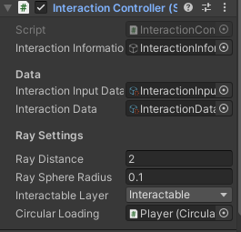

The `CheckForInteractable` method is responsible for setting the interactable in the interactionData instance when the player's raycast hit the interactable layer.  
It's also show the interaction button but activating the UI layer.

The `CheckForInteractableInput` method would perform the **Interact()** method when the **HoldDuration** is reached.  
It also displays a circular animation to show how much of the interaction is ongoing.

## DestroyInteractable

No magic there, the interaction makes the gameObject disappear:

```csharp
public class DestroyInteractable : InteractableBase
{
   public override void OnInteract()
   {
      base.OnInteract();
      DestroyImmediate(gameObject);
   }
}
```

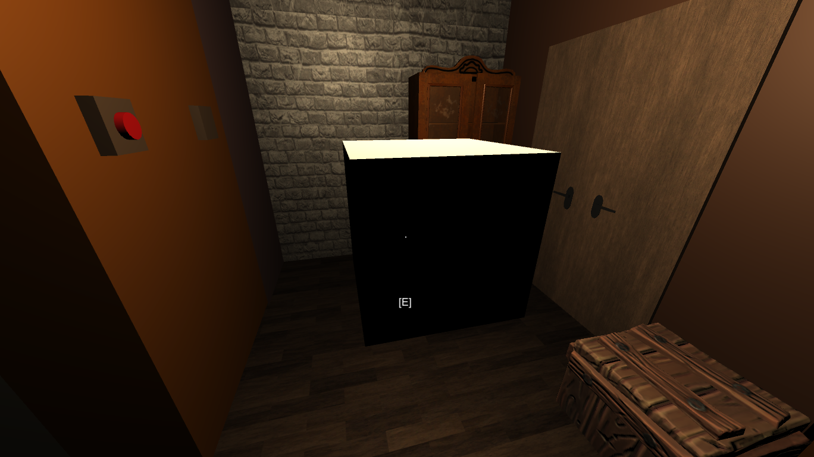  
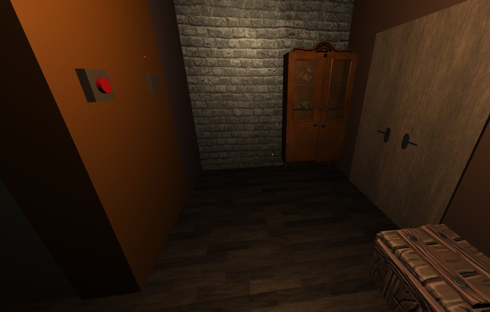

## PushInteractable

```csharp
using UnityEngine;

public class PushInteractable : InteractableBase
{
   public InteractionData interactionData;

   private Rigidbody _Rigidbody;

   private float _Thrust = 300f;

   void Start()
   {
      _Rigidbody = GetComponent<Rigidbody>();
   }

   public override void OnInteract()
   {
      SetLayerToDefault();

      _Rigidbody.AddForce(transform.forward * _Thrust);

      interactionData.Interactable.DeactivateInteraction = true;
   }

   private void SetLayerToDefault()
   {
      gameObject.layer = LayerMask.GetMask("Default");
   }
}
```

This applies a force to a rigidbody to make a push. Once done, the current layer InteractableLayer is set to default (so the information interaction text disappears) and the DeactivateInteraction is set to true. Thus, we can only interact once with the object.

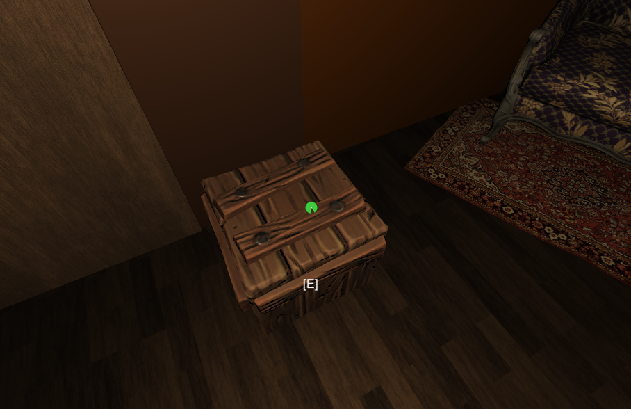  
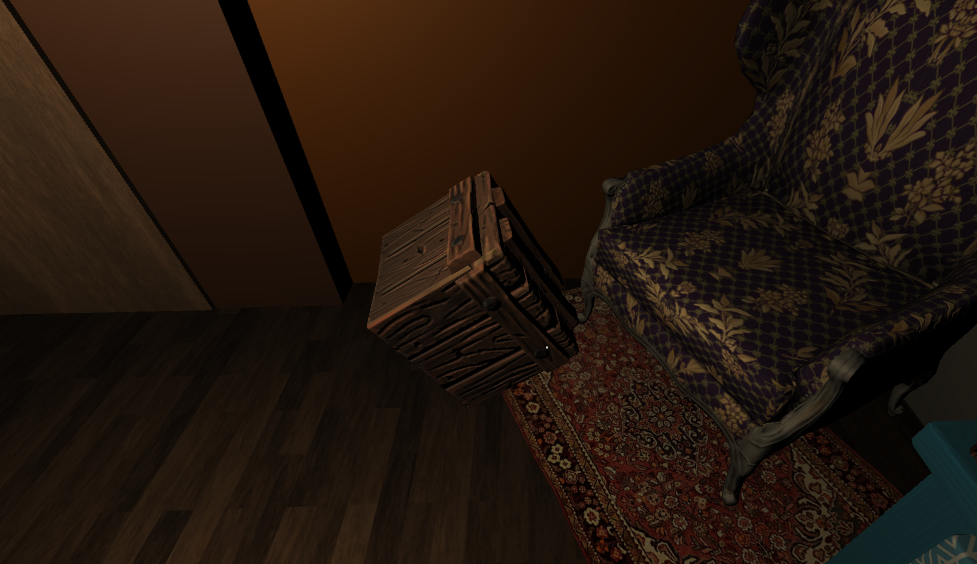

## ObserveInteractable

This one is a bit tricky so it would be explained in an other article: [Observation System](../observation-system)  
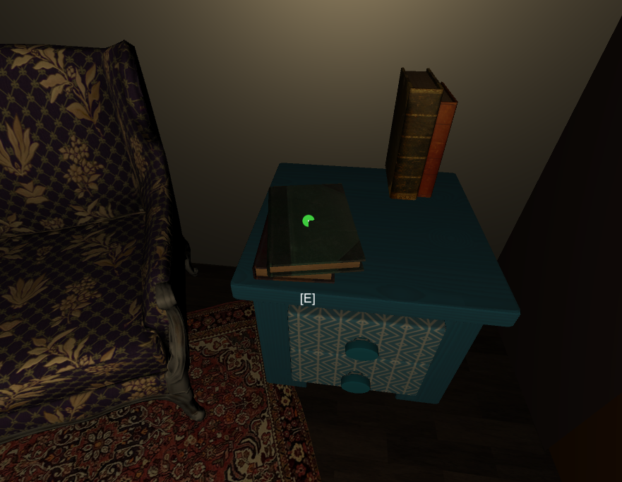  
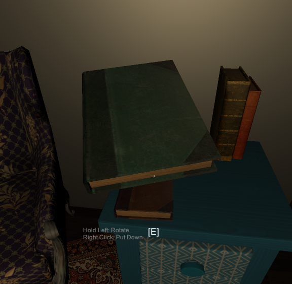  
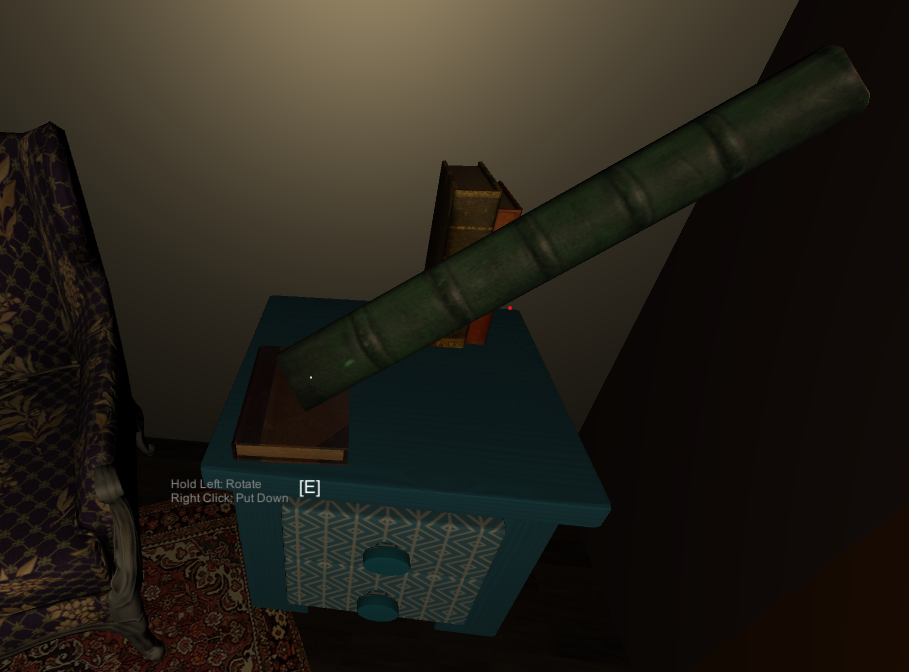

## SwitchLight

```csharp
using UnityEngine;

public class SwitchLight : InteractableBase
{
   public GameObject LightOn;

   public GameObject LightOff;

   public override void OnInteract()
   {
      if (LightOn.activeSelf)
      {
         LightOn.SetActive(false);
         LightOff.SetActive(true);
      }
      else
      {
         LightOn.SetActive(true);
         LightOff.SetActive(false);
      }
   }
}
```

Two gameobjects corresponding to two different objects need to be set and are simply set active or inactive:  
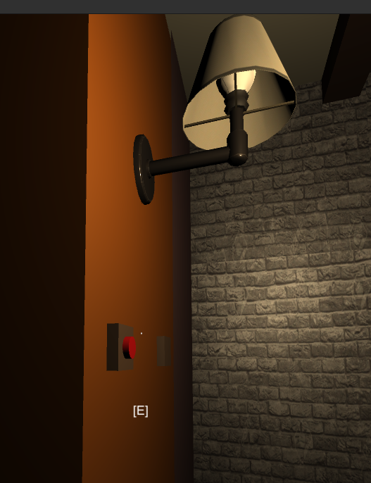  
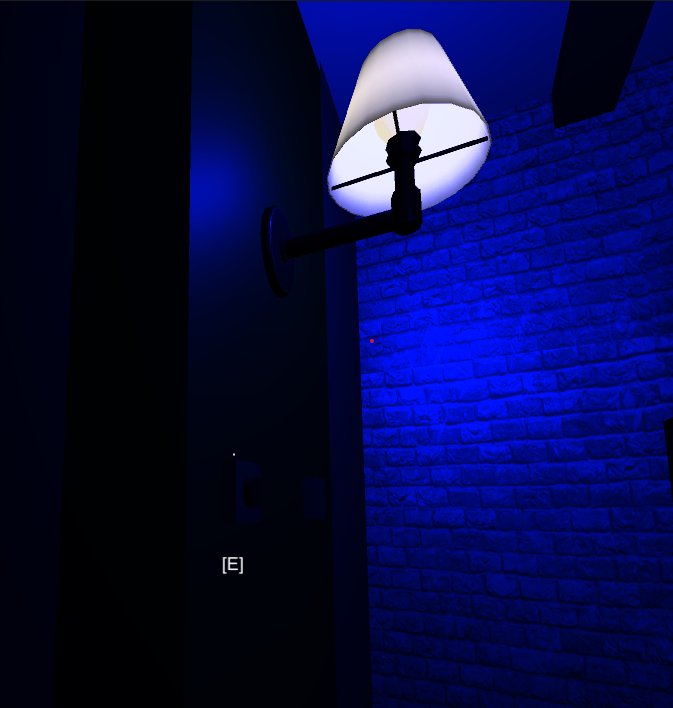

## To conclude - The key takeaways

- An `InteractionController` script is responsible for doing the interface between the **player** and the **interactable** component.
- All the interactable objects would inherit an `InteractableBase` class that satisfies an `IInteractable` interface.
- We implemented different actions: **Push**, **Observe**, **Destroy** and **Switch a light**...

#### Any remarks ?

Make a [pull request](https://github.com/ackermannQ/quentinackermann) or open an [issue](https://github.com/ackermannQ/quentinackermann/issues)!  
Don't know how to do it ? Check out this [very well explained tutorial](https://opensource.com/article/19/7/create-pull-request-github)
