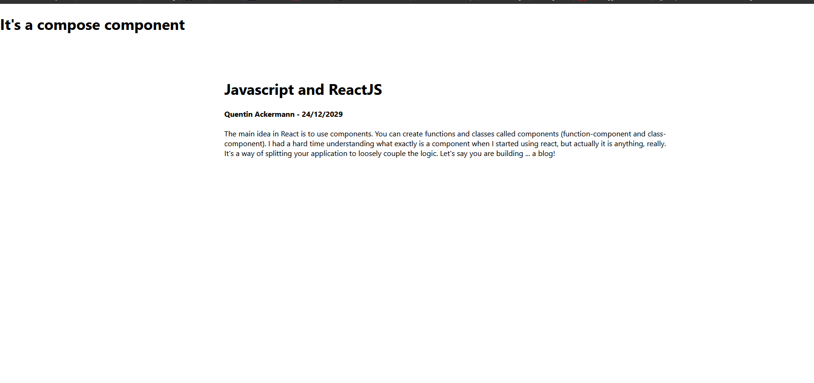
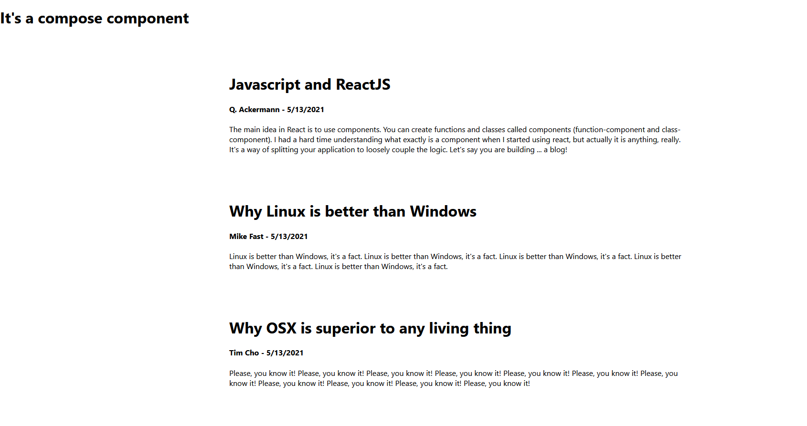
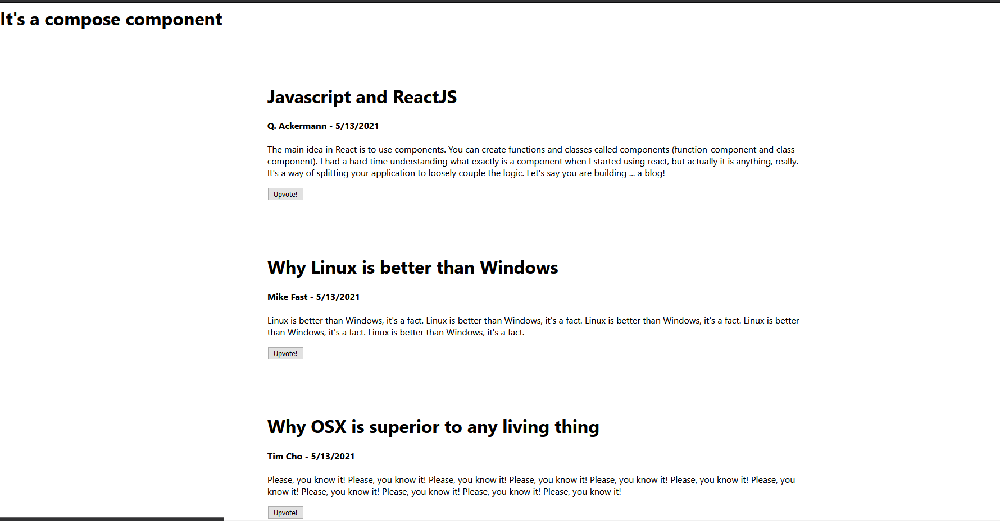
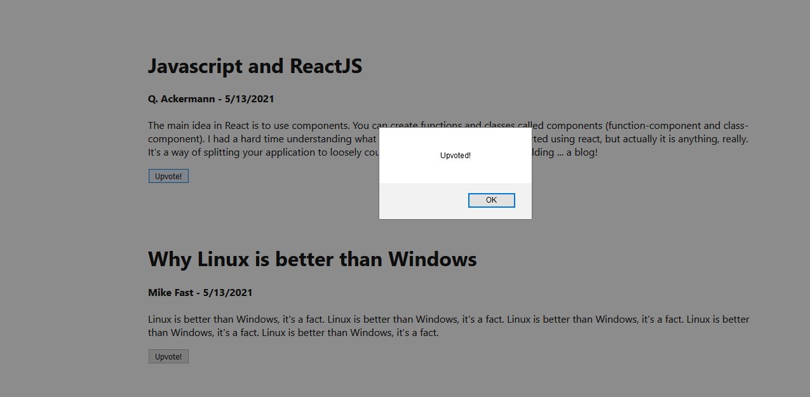
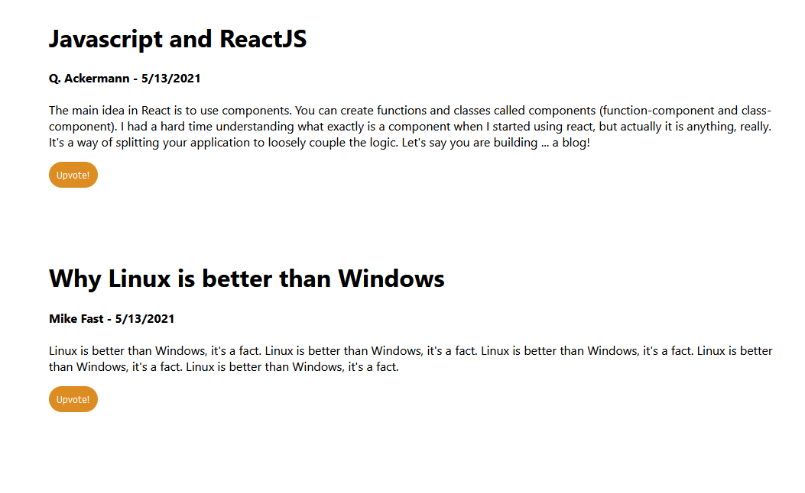

I believe in explaining with examples, so in this introduction to ReactJS, we will build a small application to write articles.  
From now, I would refere to ReactJS with react (not to be confused with <a href="https://reactnative.dev/" target="_blank" rel="nofollow noopener noreferrer">React Native</a>).

React is one of the most trendy Javascript library right now. It has been created by Facebook, thus it benefits from their reputation and is very reliable.  

One of the greatest blog I know concerning React is <a href="https://overreacted.io/" target="_blank" rel="nofollow noopener noreferrer">Overreacted</a>, written by Dan Abramov, member of the React Core team. You should definitely check this one out.  


## Idea behind React
The main idea in React is to use __components__. You can create functions and classes called components (function-component and class-component).  
I had a hard time understanding what exactly is a component when I started using react, but actually it is anything, really. It's a way of splitting your application to _loosely couple_ the logic.  
Let's say you are building ... a blog!
You will have - for instance - a header, an a main container for your page (called a body). Thus, you will have two components: 

```ts
<Header />
<Body />
```
in your blog page which could be called 

```ts
<Blog />
```


Inside your component Header, you may want to have a menu and a banner with an image. So, you will have two more components called:

```ts
 <Menu />
 <Banner />
```
which are created in separated files and called inside your Header component.

I think you know where I'm going with this, if you split well your application, you can have an intuitive logic of how it works and reusable components!  

Even though a lot more is necessary to fully understand React, this is the basics. We will see different notions while building our application.  

_Virtual DOM_: This component structure allows React to create a virtual DOM. So it's only when a particular component changes that only this one is rendered, which is very fast.  
More on this topic <a href="https://reactjs.org/docs/faq-internals.html" target="_blank" rel="nofollow noopener noreferrer">here</a>.

## The project

A lot of components compose a blog, I propose you to focus on one in particular:
- Post: The component to render a blog post with a title, the date, you name and the content

Since I'm focusing on react, I won't implement a Firebase or a database because it's not the purpose of this article. In the future when I'll talk about Fullstack development I would show an example of complete web application.  

My IDE is Visual Studio Code.  

### Setup
One very easy way to create a react application is to use the boilerplate create-react-app. Basically it will set up a template of a react project for you. The drawback is that it would install some modules you probably don't need. In any case, we will use it because it's very handy:  

In a terminal or PowerShell, navigate to the folder you want your project in.  


```powershell
npx create-react-app my-app --template typescript
```

By default the folder's name is my-app but you can use another one if you want to.  
You may have notice that I will use typescript. Why? Just because I like some of its functionalities.  

Once the installation is done, navigate to your folder my-app or so and type

```
yarn start
```

The server will start your browser on localhost:3000.
### First launch

You should have the same screen I have:  


Great! This is a starting example, now let's have a __very quick look__ at the structure of the project.  

Basically, your components will be stored in the src folder. You have an index.tsx that just creates the React virtual DOM, and an App.tsx file that display what you currently see in your browser.  

```ts
import React from 'react';
import logo from './logo.svg';
import './App.css';

function App() {
   return (
      <div className="App">
         <header className="App-header">
            
            <p>
               Edit <code>src/App.tsx</code> and save to reload.
            </p>
            <a
               className="App-link"
               href="https://reactjs.org"
               target="_blank"
               rel="noopener noreferrer"
            >
               Learn React
            </a>
         </header>
      </div>
   );
}

export default App;

```

What you will first do is delete everything in the div of the return. You may be surprised by the JSX syntax.  
To simplify, just think of it as a mix between Javascript and Html that you can call in a function:  

```ts
<h1></h1>
<p></p>
...
```


I'll show you this in a moment.  
I asked you to remove everything, so you should have something like this:  
(also remove logo and App.css)

__App.tsx__
```ts
import React from "react"

function App() {
  return (
    <div className="App">
      
    </div>
  );
}

export default App
```

If you go in your browser you now have a blank screen because you removed everything!  
In your IDE, right-Click on "src" and create a new folder, call it Compose. Then, create a file called Compose.tsx. Now, do the same for the Post component.  
You should end-up with this structure:  


## First react components

I just add this one to show you that several components could be called at the same place.  

__Compose.tsx__
```ts
export default function Compose() {

   return (
      <div>
         <h1>It's a compose component</h1>
      </div>
   );
}

```


__Post.tsx__
```ts
export default function Post() {

   return (
      <div>
         <h1>It's a post component</h1>
      </div>
   );
}

```

When you are exporting a function you'll need to use elsewhere in react, you use the keyword __export__.  
In our case, this is a __function component__ so the first letter is uppercase to show the difference with a regular method.  

You can see this is a JSX component: even though this is a function, we can use h1 or div tags inside.

Now, you need to import your brand new components to your React application. To do so, import them in the App.tsx:

**App.tsx**
```ts
import React from "react";
import Compose from './Compose/Compose';
import Post from './Post/Post';


function App() {
  return (
     <div className="App">
         <Compose />
         <Post />
   </div>
  );
}

export default App;
```


Congrat's these are your first react components up and live!  

We will start the implementation of the Post component.  

## Post component

**Post.tsx**
```ts
export default function Post() {
  return (
    <div>
      <h1>It's a post component</h1>
    </div>
  )
}
```

As I explained, this would be a component used to display the title, the author's name, the date and the content, so let's do a mockup with hard coded data:

**Post.tsx**
```ts
import React from 'react'

export default function Post() {
   return (
      <div style={{marginTop: '5%', marginLeft: '25%', marginRight: '25%'}}>
         <h1>Javascript and ReactJS</h1>
         <h4>Quentin Ackermann - 24/12/2029</h4>
         <p>
         The main idea in React is to use components. You can create functions and classes called components (function-component and class-component).  
         I had a hard time understanding what exactly is a component when I started using react, but actually it is anything, really. It's a way of splitting your application to loosely couple the logic.  
         Let's say you are building ... a blog!
         </p>
      </div>
   );
}

```


Even though writing CSS-inline is not the best practice, it is sufficient for this example. Now, our Post component looks like this:  



Well, it's not that fancy... But as you can see we have the main attributes of an article.  
You may find it weird, but setting the date by hand in a blog post is not very common, we should ask Javascript to it for us!  

**Post.tsx**
```ts
import React from 'react'

export default function Post() {
   let today = new Date();
   const dd = today.getDate();
   const mm = today.getMonth() + 1;
   const yyyy = today.getFullYear();

   const date = mm + '/' + dd + '/' + yyyy;

   return (
      <div style={{marginTop: '5%', marginLeft: '25%', marginRight: '25%'}}>
         <h1>Javascript and ReactJS</h1>
         <h4>Quentin Ackermann - {date}</h4>
         <p>
         The main idea in React is to use components. You can create functions and classes called components (function-component and class-component).  
         I had a hard time understanding what exactly is a component when I started using react, but actually it is anything, really. It's a way of splitting your application to loosely couple the logic.  
         Let's say you are building ... a blog!
         </p>
      </div>
   );
}

```

Now, we get the full date. These are classic method on the Date object in JS, don't hesitate to have a look at the <a href="https://developer.mozilla.org/fr/docs/Web/JavaScript/Reference/Global_Objects/Date/getDate" target="_blank" rel="nofollow noopener noreferrer">documentation</a>.  

What's interesting is how the "date" variable is passed to the JSX element using the curly braces {}.  
All operations have been performed in the body of the function, and then passed down to the JSX.  

This draw attention on something: you don't want to create a new component with a new title, author, content... each time !  
Actually, this is the power of react. You want to create one component, like Post and then pass arguments or properties so you can reuse it.  
The properties, that will change, are the:
- title
- author's name
- content

the date will be created in place with the object Date.

> Components have props 

The properties I listed will be passed to you component that will __render__ them. They are called __props__.  
How does it work?

You will have some "aliases" in your component for these properties, so their values doesn't matter, you will manipulate them as variables and once you call the component you will have to precise them:

```ts
<Post
   author="Q. Ackermann"
   content="This is my first article and I'm talking about programming practice..."
   title="My first article"
/>

<Post
   author="Quentin. Ackermann"
   content="The main idea in React is to use components. You can create functions and classes called components (function-component and class-component). I had a hard time understanding what exactly is a component when I started using react, but actually it is anything, really. It's a way of splitting your application to loosely couple the logic. Let's say you are building ... a blog!"
   title="Javascript and ReactJS"
/>

```

When the component is created, some properties (__props__) are passed down and it will render as you decide!

We have to rework our current component to make it happen!

### Add an interface

First, I'm going to create an interface called _PostProps_ where I precise the different props I will have. This is a <a href="https://www.typescriptlang.org/docs/handbook/2/objects.html" target="_blank" rel="nofollow noopener noreferrer">Typescript features</a> I like because you really have an idea of the properties you will manipulate.  
By associating your objects or variables to an interface - or defined types, you're assured to manipulate the right things.  
Personnally I try to order the interface's variables by name.  

**Post.tsx**

```ts
import React from "react"

interface PostProps {
   author: string;
   content: string;
   title: string;
}

export default function Post(props: PostProps) {
  let today = new Date()
  const dd = today.getDate()
  const mm = today.getMonth() + 1
  const yyyy = today.getFullYear()

  const date = mm + "/" + dd + "/" + yyyy

  return (
    <div style={{ marginTop: "5%", marginLeft: "25%", marginRight: "25%" }}>
      <h1>Javascript and ReactJS</h1>
      <h4>Quentin Ackermann - {date}</h4>
      <p>
        The main idea in React is to use components. You can create functions
        and classes called components (function-component and class-component).
        I had a hard time understanding what exactly is a component when I
        started using react, but actually it is anything, really. It's a way of
        splitting your application to loosely couple the logic. Let's say you
        are building ... a blog!
      </p>
    </div>
  )
}
```

Then these properties are called where desired.  

### Use the props in your component

**Post.tsx**

```ts
import React from "react"

interface PostProps {
  author: string
  content: string
  title: string
}

export default function Post(props: PostProps) {
  let today = new Date()
  const dd = today.getDate()
  const mm = today.getMonth() + 1
  const yyyy = today.getFullYear()

  const date = mm + "/" + dd + "/" + yyyy

  return (
    <div style={{ marginTop: "5%", marginLeft: "25%", marginRight: "25%" }}>
      <h1>{props.title}</h1>
      <h4>{props.author} - {date}</h4>
      <p>
        {props.content}
      </p>
    </div>
  )
}
```

That is one nice use of the interface. You typed your props by adding the argument to your function component:  
```ts
Post(props: PostProps)
```

Then, you need to call them in the JSX. Notice the use of the curly braces to evaluate a Javascript expression during compilation.  

The title/author and content have to be precised, so if you just save this file you are going to have an error.  
Indeed, you have to precise these props where the component is called - you have to _pass_ them to your component.  
Return to the App.tsx file, your IDE should have underlined in red the Post component because it's missing its props.  

Add the props with some values.

__App.tsx__
```ts
import React from 'react';

import Compose from './Compose/Compose';
import Post from './Post/Post';

function App() {
   return (
   <div className="App">
      <Compose />
      <Post 
         author="Quentin Ackermann"
         content="The main idea in React is to use components. You can create functions and classes called components (function-component and class-component). I had a hard time understanding what exactly is a component when I started using react, but actually it is anything, really. It's a way of splitting your application to loosely couple the logic. Let's say you are building ... a blog!"
         title="Javascript and ReactJS"
      />
      </div>
   );
}

export default App;

```

__NB:__ Normally when you are passing props in a component, curly braces are required. Like this:

**App.tsx**

```ts
import React from "react"

import Compose from "./Compose/Compose"
import Post from "./Post/Post"

function App() {
  return (
    <div className="App">
      <Compose />
      <Post
        author={"Quentin Ackermann"}
        content={"The main idea in React is to use components. You can create functions and classes called components (function-component and class-component). I had a hard time understanding what exactly is a component when I started using react, but actually it is anything, really. It's a way of splitting your application to loosely couple the logic. Let's say you are building ... a blog!"}
        title={"Javascript and ReactJS"}
      />
    </div>
  )
}

export default App
```

There is one exception though, it is not mandatory if you are passing strings.  


Great!
You probably notice that some blogs - like <a href="https://medium.com/" target="_blank" rel="nofollow noopener noreferrer">Medium</a> have a lot of articles with different authors and content. The way to address this in React is by reusing components: you can now have a variety of articles without creating a component specific for each one.

**App.tsx**

```ts
import React from "react"

import Compose from "./Compose/Compose"
import Post from "./Post/Post"

function App() {
  return (
    <div className="App">
      <Compose />
      <Post
        author="Quentin Ackermann"
        content="The main idea in React is to use components. You can create functions and classes called components (function-component and class-component). I had a hard time understanding what exactly is a component when I started using react, but actually it is anything, really. It's a way of splitting your application to loosely couple the logic. Let's say you are building ... a blog!"
        title="Javascript and ReactJS"
      />

      <Post 
         author="Mike Fast"
         content="Linux is better than Windows, it's a fact. Linux is better than Windows, it's a fact. Linux is better than Windows, it's a fact. Linux is better than Windows, it's a fact. Linux is better than Windows, it's a fact. "
         title="Why Linux is better than Windows"
      />

      <Post
         author="Tim Cho"
         content="Please, you know it! Please, you know it! Please, you know it! Please, you know it! Please, you know it! Please, you know it! Please, you know it! Please, you know it! Please, you know it! Please, you know it! Please, you know it! "
         title="Why OSX is superior to any living thing"
      />

    </div>
  )
}

export default App;
```



## Add an action button

For now, we mostly have rendered components without any logic inside. Let's change this!  
Often you will have an action button next to an article, for instance to upvote or do some kind of action.  
I propose you to create a button, style it and add it to our Post component, so each time we use Post, we will have the button component rendered as well!  

Create a new folder called CustomButton as well as a file (don't forget the tsx extension).  
Then create the template for you button code (if you're using vscode, check out <a href="https://marketplace.visualstudio.com/items?itemName=xabikos.ReactSnippets" target="_blank" rel="nofollow noopener noreferrer">this extension</a> to use some snippets in order to speed up your development).  

You should have something similar, now:

```ts
import React from 'react';

export default function CustomButton() {
   return (
      <div>

      </div>
   );
}

```

So, let's create a button to alert the user once once clicked!

__CustomButton.tsx__
```ts
import React from "react"

export default function CustomButton() {

   function handleClick() {
      alert('Upvoted!');
   }

  return (
     <div>
         <button onClick={handleClick}>Upvote!</button>
     </div>
  );
}
```

The onClick property allows us to pass a function that will be called once the user click on the button.  
As you can see the handleClick method is defined in the body of our function component CustomButton.  
handleClick is just a popular name when a function is called in a onClick property of a button, however it's not the best naming convention you could see!  
Something like alertUserOnceUpvoted() would be better.  
Note that regular function doesn't have a first letter in uppercase.  

We just have to add this component in our Post!  

**Post.tsx**

```ts
import React from "react";

import CustomButton from '../CustomButton/CustomButton';


interface PostProps {
  author: string
  content: string
  title: string
}

export default function Post(props: PostProps) {
  let today = new Date()
  const dd = today.getDate()
  const mm = today.getMonth() + 1
  const yyyy = today.getFullYear()

  const date = mm + "/" + dd + "/" + yyyy

  return (
    <div style={{ marginTop: "5%", marginLeft: "25%", marginRight: "25%" }}>
      <h1>{props.title}</h1>
      <h4>
        {props.author} - {date}
      </h4>
      <p>{props.content}</p>
      <CustomButton />
    </div>
  )
}
```

Now, each time our Post component is called, it will also render the CustomButton inside.

  

And the button is working:


## Style the action button

In the CustomButton folder, add a new file named CustomButton.css, and import it in the component:

**CustomButton.tsx**

```ts
import React from "react";

import './CustomButtons.css';

export default function CustomButton() {

   function handleClick() {
      alert('Upvoted!');
   }

  return (
     <div>
         <button className="button" onClick={handleClick}>Upvote!</button>
     </div>
  );
}
```

Add a className to your button and some CSS:

__CustomButton.css__ 
```css
.button {
   background-color: #dd8c22;
   border: none;
   border-radius: 30px;
   color: white;
   padding: 10px 10px;
   text-align: center;
   text-decoration: none;
   display: inline-block;
   font-size: 12px;
}

.button:hover {
   background-color: #b3711b;
   cursor: pointer;
}

```



Well, not bad for a first react implementation!

With this introduction, you should have understood two important things concerning React:
- How to create components with some style
- How to pass props and the benefits of this architecture

It's very important to first get the feeling on what React should do.  
So try to build some simple components, and we will implement larger projects later.
## To conclude - The key takeaways

In this article, you've learnt some things:

- How to create a react project: npx create-react-app my-app --template typescript
- Start your development server with yarn start
- What is a component in react and how to create them
- How to pass down props to a component
- How to style a component
- You can find the full project <a href="https://github.com/ackermannQ/intro-to-react" target="_blank" rel="nofollow noopener noreferrer">here</a>

This article is meant to be an introduction so I voluntarily didn't tackle problems related to classes and states, functions and hooks.  
I focused on function components there because I think it's easier to get a grasp on it.  
Besides, Javascript (thus its superset Typescript) is a [functional programming language](../functional-programming) so let just say that it was closer to the paradigm.  
don’t recommend
If you want to go further right now and have an idea about the differences between class and function components in react, just read this <a href="https://overreacted.io/how-are-function-components-different-from-classes/" target="_blank" rel="nofollow noopener noreferrer">amazing article!</a>
#### Any remarks ?

Make a [pull request](https://github.com/ackermannQ/quentinackermann) or open an [issue](https://github.com/ackermannQ/quentinackermann/issues)!  
Don't know how to do it ? Check out this [very well explained tutorial](https://opensource.com/article/19/7/create-pull-request-github)

