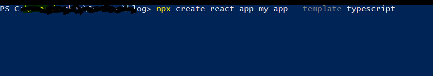
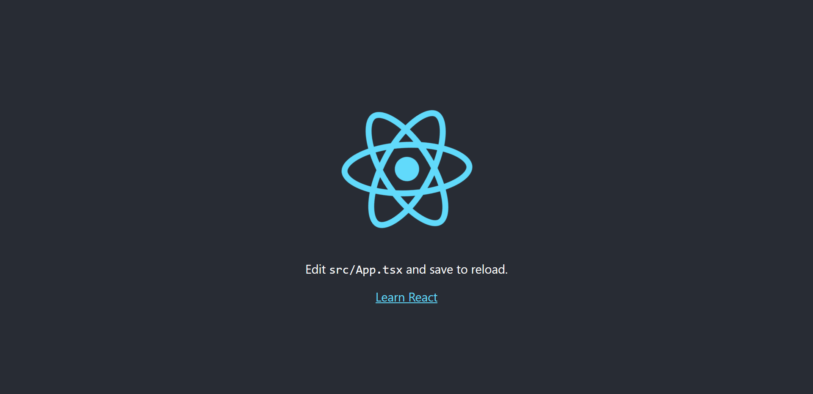
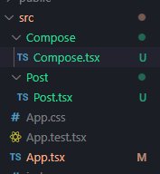
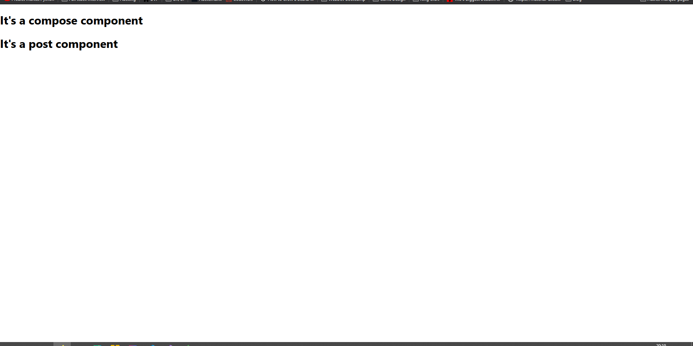

I believe in explaining with examples, so in this introduction to ReactJS, we will build a small application to write articles.  
From now, I would refere to ReactJS with react (not to be confused with [React Native](https://reactnative.dev/)).  

React is one of the most trendy Javascript library right now. It has been created by Facebook, thus it benefits from their reputation and is very reliable.  

One of the greatest blog I know concerning React is [Overreacted](https://overreacted.io/), written by Dan Abramov, member of the React Core team.  


## Idea behind React
The main idea in React is to use __components__. You can create functions and classes called components (function-component and class-component).  
I had a hard time understanding what exactly is a component when I started using react, but actually it is anything, really. It's a way of splitting your application to _loosely couple_ the logic.  
Let's say you are building ... a blog!
You will have - for instance - a header, an a main container for your page (called a body). Thus, you will have two components: 

```ts
<Header />
<Body />
```
in your blog page which could be called 

```ts
<Blog />
```


Inside your component Header, you may want to have a menu and a banner with an image. So, you will have two more components called:

```ts
 <Menu />
 <Banner />
```
which are created in separated files and called inside your Header component.

I think you know where I'm going with this, if you split well your application, you can have an intuitive logic of how it works and reusable components!  

Even though a lot more of knowledge is necessary to understand React, but this is the basics. We will see different notions while building our application.  

_Virtual DOM_: This component structure allows React to create a virtual DOM. So it's only when a particular component changes that only this one is rendered, which is very fast.  
More on this topic [here](https://reactjs.org/docs/faq-internals.html).

## The project

A lot of components compose a blog, I propose you to focus on two in particular:
- Compose: The component to compose a blog post with a title, the date, you name and the content
- Post: The component to render these modifications

Since I'm focusing on react, I won't implement a Firebase or a database because it's not the purpose of this article. In the future when I'll talk about Fullstack development I would show an example of complete web application.  

My IDE is Visual Studio Code.  

### Setup
One very easy way to create a react application is to use the boilerplate create-react-app. Basically it will set up a template of a project for you. The drawback is that it would install some feature you probably don't need. In any case, we will use it because it's very handy:  

In a terminal or PowerShell, navigate to the folder you want your project in.  


```powershell
npx create-react-app my-app --template typescript
```

By default the folder's name is my-app but you can use another one if you want to.  
You may have notice that I will use typescript. Why? Just because I like some of its functionalities.  

Once the installation is done, navigate to your folder my-app or so and type

```
yarn start
```

By default it will start your browser on localhost:3000.
### First start

You should have the same screen I have:  



Great! This is a starting example, now let's have a __very quick look__ at the structure of the project.  

Basically, your components will be stored in the src folder. You have an index.tsx that just creates the React virtual DOM, and an App.tsx file that display what you currently see in your browser.  

```ts
import React from 'react';
import logo from './logo.svg';
import './App.css';

function App() {
   return (
      <div className="App">
         <header className="App-header">
            
            <p>
               Edit <code>src/App.tsx</code> and save to reload.
            </p>
            <a
               className="App-link"
               href="https://reactjs.org"
               target="_blank"
               rel="noopener noreferrer"
            >
               Learn React
            </a>
         </header>
      </div>
   );
}

export default App;

```

What you will first do is delete everything in the div of the return. You may be surprised by the syntax, which actually is JSX.  
To simplify, just think of it as a mix between Javascript and Html, you can call in a function JSX element like  

```ts
<h1></h1>
<p></p>
...
```


I'll show you this in a moment.  
I asked you to remove everything, so you should have something like this:  
(also remove logo and App.css)

__App.tsx__
```ts
import React from "react"

function App() {
  return (
    <div className="App">
      
    </div>
  );
}

export default App
```

If you go to your brother you now have a blank screen because indeed you removed everything!  
In your IDE, right-Click on "src" and create a new folder, call it Compose. Then, create a file called Compose.tsx. Now, do the same for the Post component.  
You should end-up with this structure:  




## First react components

__Compose.tsx__
```ts
export default function Compose() {

   return (
      <div>
         <h1>It's a compose component</h1>
      </div>
   );
}

```


__Post.tsx__
```ts
export default function Post() {

   return (
      <div>
         <h1>It's a post component</h1>
      </div>
   );
}

```

When you are exporting a function you'll need to use elsewhere in react, you use the keyword __export__.  
In our case, this is a __function component__ so the first letter is uppercase to show the difference with a regular method.  

You can see this is a JSX component: even though this is a function, we can use h1 or div tags inside.

Now, you need to import your brand new components to your React application. To do so, you have to use them in the App.tsx:

**App.tsx**
```ts
import React from "react";
import Compose from './Compose/Compose';
import Post from './Post/Post';


function App() {
  return (
     <div className="App">
         <Compose />
         <Post />
   </div>
  );
}

export default App;
```



Congrat's these are you first react components up and live!  

We will start the implementation with the Post component. This would be easier to understand some notions when you get why you need them.  

## Post component

**Post.tsx**
```ts
export default function Post() {
  return (
    <div>
      <h1>It's a post component</h1>
    </div>
  )
}
```

As I explained, this would be a component used to display the title, the author's name, the date and the content:

**Post.tsx**

```ts
import React from 'react'

export default function Post() {
   return (
      <div style={{marginTop: '5%', marginLeft: '25%', marginRight: '25%'}}>
         <h1>Javascript and ReactJS</h1>
         <h4>Quentin Ackermann - 24/12/2029</h4>
         <p>
         The main idea in React is to use components. You can create functions and classes called components (function-component and class-component).  
         I had a hard time understanding what exactly is a component when I started using react, but actually it is anything, really. It's a way of splitting your application to loosely couple the logic.  
         Let's say you are building ... a blog!
         </p>
      </div>
   );
}

```


## To conclude - The key takeaways

#### Any remarks ?

Make a [pull request](https://github.com/ackermannQ/quentinackermann) or open an [issue](https://github.com/ackermannQ/quentinackermann/issues)!  
Don't know how to do it ? Check out this [very well explained tutorial](https://opensource.com/article/19/7/create-pull-request-github)

