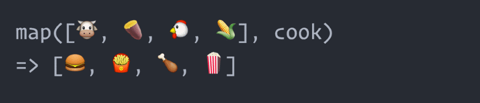

Map is used for transforming an array into an other array. You can think of it exactly the same as for a mathematical (bijective... Drop this notion if it is not familiar) function, you have a set of departure and a set of destination:  

For each element from you departure set, you will associate an element of the destination set. The function (the arrow) is exactly the map function in Javascript.  

An other funny way to understand the use of map is:  

## Example of use

## Implementation

## To conclude - The key takeaways

You can go further with the [filter](../filter) and [reduce](../reduce) methods.

#### Any remarks ?

Make a [pull request](https://github.com/ackermannQ/quentinackermann) or open an [issue](https://github.com/ackermannQ/quentinackermann/issues)!  
Don't know how to do it ? Check out this [very well explained tutorial](https://opensource.com/article/19/7/create-pull-request-github)

