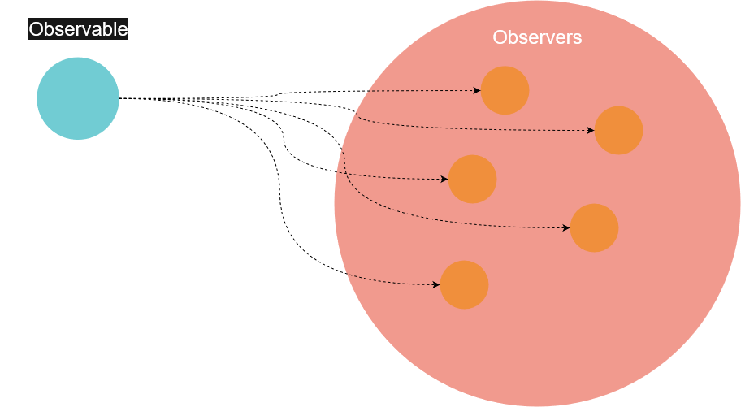
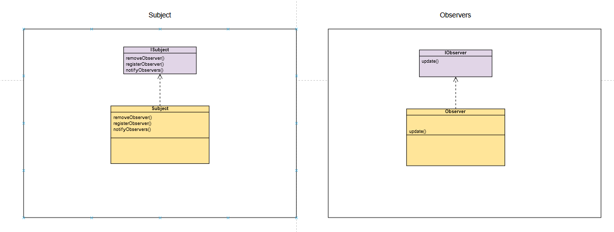
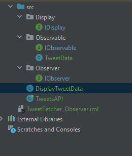

How does it work ?  
An __observer__ _registers_ with a __subject__ (or __observable__) which would notify the observer when its state updates.

> This pattern is used when the change of state in one object would impact other objects.

## Theory - Use case

Simply put, you have an object that live its life, it's the **Observable**. At some point, it has some data that would interest other objects, the **Observers**.  
In order to become an observer of the observable, an object has to *register*. Then, the observable will send the data to the observers:  

 


This defines a one-to-many dependency between objects so that when one of them (the observable) changes, all of its dependents (the observers) are notified and updated automatically.



The subject can register, remove or notify observers and the only purpose of the observer is to ... Observe. And **update** once it get notified.  
As we are aiming to get more flexibility, we can notice that we have loosely coupled objects: the subject only knows that the Observer implement the IObserver interface.  

## Implementation - Example

Let's say you are building a web site, and among the functionalities you would like to retrieve some tweets from an external API. From our point of view we are receiving a JSON with the author's name and the content of a tweet.  
Following the previous methodology, we are going to create two interfaces: one for the observer and one for the observable. 

**IObserver**:

```java
public interface IObserver {

   void update(String tweetAuthor, String tweetContent);
}

```

Our observer needs to have an update method that would take in argument the _tweetAuthor_ and _tweetContent_. These are the data we are looking for. In a real-life situation, these data would be ofc further exploited.  


**IObservable**:

```java

public interface IObservable {

    void registerObserver(IObserver o);
    void removeObserver(IObserver o);
    void notifyObservers();

}


```

If you remember the observable has three main jobs, register/remove observers or notify them all. That's the abstracted functionality described in this interface __IObservable__.  


I will add one more interface for displaying the information:

__IDisplay__:

```java
public interface IDisplay {

    public void display();

}

```

Then, the class implementing the IObservable interface:

__TweetData class__:
```java
import java.util.ArrayList;

public class TweetData implements IObservable {
   private ArrayList observers;
   private String tweetAuthor;
   private String tweetContent;

   public TweetData() {
      observers = new ArrayList();
   }

   @Override
   public void registerObserver(IObserver o) {
      observers.add(o);
   }

   @Override
   public void removeObserver(IObserver o) {
      int index = observers.indexOf(o);
      if (index >= 0) {
         observers.remove(index);
      }
   }

   @Override
   public void notifyObservers() {
      for (int i = 0 ; i < observers.size(); i++) {
         IObserver observer = (IObserver) observers.get(i);
         observer.update(tweetAuthor, tweetContent);
      }
   }

   public void dataChanged() {
      notifyObservers();
   }

   public void setData(String tweetAuthor, String tweetContent) {
      this.tweetAuthor = tweetAuthor;
      this.tweetContent = tweetContent;
      dataChanged();
   }

}

```

In the constructor, we initialize an ArrayList to contain our observers added in the registerObserver method.  
To remove a particular observer, we remove it from the same array.  
The observers are notified, so we call for each one the update method with the tweetAuthor and tweetContent. Of course notifyObservers is called only when the data changed.  
Finally, we set the data with the setData method.  


**DisplayTweetData class**:
```java
public class DisplayTweetData implements IObserver, IDisplay {
   private String tweetAuthor;
   private String tweetContent;
   private IObservable tweetData;

   public DisplayTweetData(IObservable tweetData) {
      this.tweetData = tweetData;
      tweetData.registerObserver(this);
   }


   @Override
   public void display() {
      System.out.println(tweetAuthor + " says: " + tweetContent);
   }

   @Override
   public void update(String tweetAuthor, String tweetContent) {
      this.tweetAuthor = tweetAuthor;
      this.tweetContent = tweetContent;
      display();
   }

}

```

In the constructor we initialize an IObservable object and we register the observer to it.  
The display method is straightforward.  
The update function retrieves the new tweetAuthor and content to display them.


__TweetsAPI class__:
```java
public class TweetsAPI {
   public static void main(String[] args) {

      TweetData tweetData = new TweetData(); // Observable

      DisplayTweetData displayTweetData = new DisplayTweetData(tweetData); // Observer

      tweetData.setData("@Quentin", "This is the observer pattern"); // Set Mockup data
      tweetData.setData("@Tom", "Design patterns are so cool.");
      tweetData.setData("@Maggie", "I don't like the spider pig!");

   }

}

```

When the API have data (thus the observable have new data), it will send it to the observer. As you can see we don't call ourselve the update or display method.  

> It was only when the state changed that the data were sent to the observer

Finally, we end-up with the following output:
```
@Quentin says: This is the observer pattern
@Tom says: Design patterns are so cool.
@Maggie says: I don't like the spider pig!

```

## To conclude - The key takeaways

__NB:__ I voluntarily removed my imports in the code so you are not dependant of the tree structure I used. Using IntelliJ or any good IDE, you will be able to import your classes/interfaces as needed.  


An observer pattern defines a one-to-many dependency between objects so that when one of them (the observable) changes, all of its dependents (the observers) are notified and updated automatically.  
This is used when the change of state in one object would impact other objects.  
Put differently, it's only when the subject changes that it notifies the observers. You don't have to implement a method that continually fetch the data.  

- It's easy to add, remove or replace observers at the runtime
- Don't have to change or modify the observable to add new types of observers
- Observers and observable are reusable
- Loose coupling: a change of implementation in one of them doesn't affect the other one

> Great flexibility

- You could also check out my article on [design patterns](../design-patterns/)
- The project is <a href="https://github.com/ackermannQ/design_patterns/tree/master/ObserverPattern/src" target="_blank" rel="nofollow noopener noreferrer">available here</a>

#### Any remarks ?

Make a [pull request](https://github.com/ackermannQ/quentinackermann) or open an [issue](https://github.com/ackermannQ/quentinackermann/issues)!  
Don't know how to do it ? Check out this [very well explained tutorial](https://opensource.com/article/19/7/create-pull-request-github)

