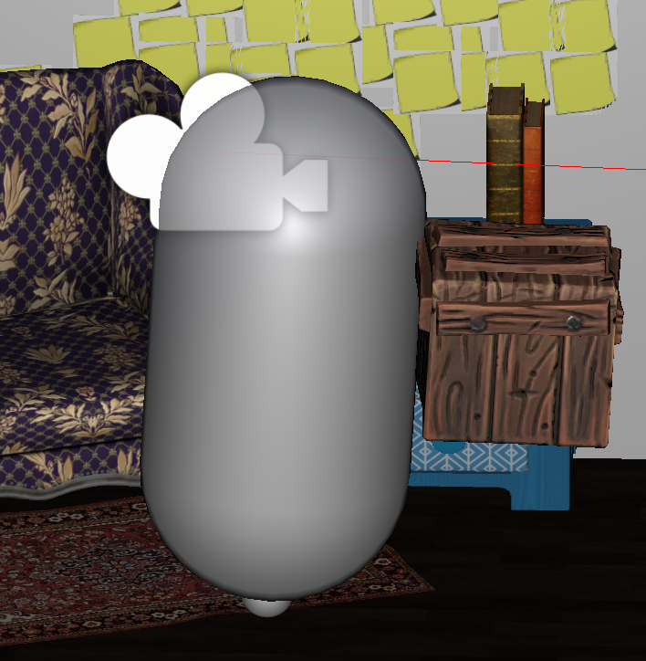

To make my Escape Room game more interactable, I didn't simply need [Interactable Objects](../interaction-system).  
Some items should be pickable, for instance a hammer to break something or a key to use and more generally for a better immersion inside the game.  
As a consequence, I needed to think about a grab system to fit my game's needs.

First, we need to know the object will be pickable. Thus, a `PickableItem` class should be created:

## PickableItem

```csharp
using UnityEngine;

[RequireComponent(typeof(Rigidbody))]
public class PickableItem : MonoBehaviour
{
    // This script is on the pickable object
    public GameObject GrabInformation;
    public Rigidbody Rb => rb;

    protected Rigidbody rb;

    void Awake()
    {
        rb = GetComponent<Rigidbody>();
    }

    private void OnMouseOver()
    {
        GrabInformation.SetActive(true);
    }

    private void OnMouseExit()
    {
        GrabInformation.SetActive(false);
    }
}

```

In the Awake method (called when the script instance is loaded) the reference to the rigidbody is stored inside the private member rb, accessible through the public member Rb.

Then, the `GrabSystem` per say:

## GrabSystem

```csharp
using System.Collections;
using UnityEngine;

public class GrabSystem : MonoBehaviour
{
   // This script is on the player
   public GameObject DropInformation;

   public Camera PlayerCamera;

   private PickableItem _pickableItem;

   [SerializeField]
   private Transform slot;

   private void Update()
   {
      if (Input.GetButtonDown("Fire1"))
      {
         if (!_pickableItem)
         {
            var ray = PlayerCamera.ViewportPointToRay(Vector3.one * 0.5f);

            if (Physics.Raycast(ray, out RaycastHit hit, 2f))
            {
               var pickable = hit.transform.GetComponent<PickableItem>();

               if (pickable)
               {
                  PickItem(pickable);
                  StartCoroutine(DropItemInformation());
               }
            }
         }
      }

      if (_pickableItem && Input.GetButtonDown("Fire1"))
      {
         Debug.Log("Pickable Action!");
      }

      if (Input.GetButtonDown("Fire2"))
      {
         if (_pickableItem)
         {
            DropItem(_pickableItem);
         }
      }
   }

   /// <summary>
   /// Method for picking up an item.
   /// </summary>
   /// <param name="item">Item.</param>
   private void PickItem(PickableItem pickableItem)
   {
      _pickableItem = pickableItem;

      pickableItem.Rb.isKinematic = true;

      pickableItem.transform.SetParent(slot);

      Reset(pickableItem);
   }

   private void Reset(PickableItem pickableItem)
   {
      ResetVelocities(pickableItem);
      ResetPosAndRotations(pickableItem);
   }

   private void ResetVelocities(PickableItem pickableItem)
   {
      pickableItem.Rb.velocity = Vector3.zero;
      pickableItem.Rb.angularVelocity = Vector3.zero;
   }

   private void ResetPosAndRotations(PickableItem pickableItem)
   {
      pickableItem.transform.localPosition = Vector3.zero;
      pickableItem.transform.localEulerAngles = Vector3.zero;
   }

   IEnumerator DropItemInformation()
   {
      DropInformation.SetActive(true);
      yield return new WaitForSeconds(3.0f);
      DropInformation.SetActive(false);
   }

   /// <summary>
   /// Method for dropping an item.
   /// </summary>
   /// <param name="item">Item.</param>
   private void DropItem(PickableItem pickableItem)
   {
      _pickableItem = null;

      pickableItem.transform.SetParent(null);

      pickableItem.Rb.isKinematic = false;

      pickableItem.Rb.AddForce(pickableItem.transform.forward * 2, ForceMode.VelocityChange);
   }
}
```

The point here is to have some sort of "shadow" slot (corresponding to the cube in the following picture) where the object would be placed once the player grabs it.


The `DropInformation` shows the indication to drop the object.  
The `_pickableItem` private member is required to store the reference to the PickedItem.

Now, let's detail what is happening during the Update method.

When the left click is pressed, we want to be sure to perform the action only if we don't have a pickable object yet.  
Then:

```csharp
var ray = PlayerCamera.ViewportPointToRay(Vector3.one * 0.5f);

   if (Physics.Raycast(ray, out RaycastHit hit, 2f))
```

This part is used to check if an object is within range and if it's pickable the `PickItem` method is called. The coroutine displays the UI indicating how to drop an item.
If an object is already picked and the left click is pressed again, the pickable item action is triggered:

```csharp
if (_pickableItem && Input.GetButtonDown("Fire1"))
{
   Debug.Log("Pickable Action!");
}
```

Finally, if an object is picked and the player press right click, the item is dropped:

```csharp
if (Input.GetButtonDown("Fire2"))
{
   if (_pickableItem)
   {
      DropItem(_pickableItem);
   }
}
```

Now, let's analyse the `PickItem` and `DropItem` methods.

## PickItem

The idea is simple, the `PickItem` method remove the gravity from the object's rigidbody, set the slot as parent for the item picked-up and reset the transform information.
As a consequence, the actual position for the picked item is the one occupied by the slot gameobject.

```csharp
private void PickItem(PickableItem pickableItem)
{
   _pickableItem = pickableItem;

   pickableItem.Rb.isKinematic = true;

   pickableItem.transform.SetParent(slot);

   Reset(pickableItem);
}

private void Reset(PickableItem pickableItem)
{
   ResetRbVelocities(pickableItem);
   ResetPosAndRotations(pickableItem);
}

private void ResetRbVelocities(PickableItem pickableItem)
{
   pickableItem.Rb.velocity = Vector3.zero;
   pickableItem.Rb.angularVelocity = Vector3.zero;
}

private void ResetPosAndRotations(PickableItem pickableItem)
{
   pickableItem.transform.localPosition = Vector3.zero;
   pickableItem.transform.localEulerAngles = Vector3.zero;
}
```

With the [Clean Code](https://www.amazon.fr/Clean-Code-Handbook-Software-Craftsmanship/dp/0132350882) in mind, the methods are thoroughly separated and named correctly.

`ResetRbVelocities` reset the rigidbody velocity and the [angular velocity](https://courses.lumenlearning.com/physics/chapter/6-1-rotation-angle-and-angular-velocity/).  
`ResetPosAndRotations` reset the local position and the [Euler angles](https://mathworld.wolfram.com/EulerAngles.html) of the item relatively to the parent.


## DropItem

The `DropItem` method reverse the action of the `PickItem`:

```csharp
private void DropItem(PickableItem pickableItem)
{
   _pickableItem = null;

   pickableItem.transform.SetParent(null);

   pickableItem.Rb.isKinematic = false;

   pickableItem.Rb.AddForce(pickableItem.transform.forward * 4, ForceMode.VelocityChange);
}
```

The reference to the picked item is removed as well as the parent slot.  
The rigidbody is not kinematic anymore which means the physics could apply again to it.  
Finally, a small force is added to simulate a throw effect when the object is released.


## To conclude - The key takeaways

To implement a simple picking-up system, one needs:

- A class like `PickableItem` to get the rigidbody of the object and display some UI related to the action
- A `GrabSystem` relying on a `PickItem` and a `DropItem` methods that would place the object as a child of a predefined slot



Now, the `GrabSystem` class could be improved to make the pick-up objects usable.

#### Any remarks ?

Make a [pull request](https://github.com/ackermannQ/quentinackermann) or open an [issue](https://github.com/ackermannQ/quentinackermann/issues)!  
Don't know how to do it ? Check out this [very well explained tutorial](https://opensource.com/article/19/7/create-pull-request-github)
