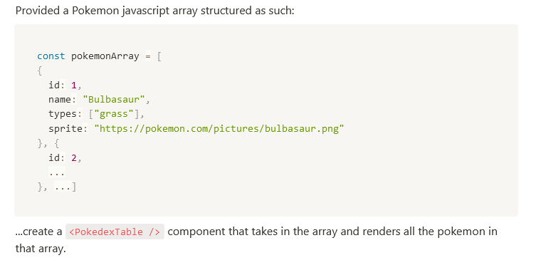

As I was doing some research on a [topic I was interested in](https://reactjs.org/blog/2020/12/21/data-fetching-with-react-server-components.html) I came accross a mock-up interview [Dan Abramov](https://overreacted.io/) made with [Theo - T3 Tool](https://www.youtube.com/watch?v=uqII0AOW1NM).  
The principle was simple, Dan was provided a backend sending message objects and he had to build a nice front-end from there.
In the video description, a link points to the [interview options](https://t3-tools.notion.site/Technical-Interview-Dan-Abramov-9aa6d8e9292e4bd1ae67b44aeeaabf88) Dan had.  
I thought it could be funny to try the option 2 that addresses junior to midlevel frontend developers.  
So that's pretty much it, now what about the [Pokedex Problem](https://t3-tools.notion.site/Pokedex-Problem-90f9dcfff10d4418a6fad44581b1ecff)?

## Setting-up the environment

Just follow the "Setup" step of my <a href="../introduction-to-reactjs" target="\_blank" rel="nofollow noopener noreferrer">introduction to reactJS</a>


Once the installation finished you should have exactly the same boilerplate I have.  
Remove all the code from App.js inside the highest div and let's think a bit about the first part of the problem.

## Part 1


We are asked to create a <PokemonRow /> component that needs to be reusable and renders all the data in the object.  
So let's do exactly that:

_App.js_

```js
import React from "react"

const bulbasaur = {
  id: 1,
  name: "Bulbasaur",
  types: ["grass"],
  sprite: "https://pokemon.com/pictures/bulbasaur.png",
}

export default function App() {
  return (
    <div className="App">
      <PokemonRow pokemon={bulbasaur} />
    </div>
  )
}
```

Currently, we didn't create the `PokemonRow` component so the linter would underlined it in red.

Then, we need to create a new tsx (typescript with jsx) file intitled `PokemonRow`. In order to add typescript to the project we have to run the following command:

```
npm install --save typescript @types/node @types/react @types/react-dom @types/jest

```

in the project folder.

_PokemonRow.tsx_

```tsx
import React from "react"

export default function PokemonRow() {
  return <div></div>
}
```

One great feature of typescript is interface. It helps providing types for the object we manipulate.  
We could defined an interface `IPokemon` to characterize the contract a pokemon object will satisfy:

_App.tsx_

```tsx
import React from "react"
import PokemonRow from "./PokemonRow"

export interface IPokemon {
  id: number
  name: string
  types: Array<string>
  sprite: string
}

const bulbasaur: IPokemon = {
  id: 1,
  name: "Bulbasaur",
  types: ["grass"],
  sprite: "https://pokemon.com/pictures/bulbasaur.png",
}

export default function App() {
  return (
    <div className="App">
      <PokemonRow pokemon={bulbasaur} />
    </div>
  )
}
```

The `IPokemon` interface requires a pokemon object to have some mandatory attributes. Notice we need to convert the App.js file to App.tsx file to use interface inside.
I also imported the `PokemonRow` component. Then, I typed the `bulbasaur` object.

Regarding the `PokemonRow`:

_PokemonRow.tsx_

```tsx
import React from "react"
import { IPokemon } from "./App"

interface PokemonRowProps {
  pokemon: IPokemon
}

export default function PokemonRow(props: PokemonRowProps) {
  return (
    <div>
      {props.pokemon.id}
      {props.pokemon.name}
      {props.pokemon.types.map(type => (
        <li>{type}</li>
      ))}
      {props.pokemon.sprite}
    </div>
  )
}
```

I created a `PokemonRowProps` interface for the props.  
Notice that the nomenclature is slightly different there: when I'm typing the form of the data I would name the interface `ISomething` while when I'm typing the props I would use `SomethingComponentNameProps`. I personnally think it's a nice way to set apart data and props.

Since the `types` attribute is an array a map should be used to render each element as a list.

For now I just simple render the different attributes just to be sure I can display the data:

```
1Bulbasaur
grass
https://pokemon.com/pictures/bulbasaur.png

```

Now, let's create a table with a row:

_PokemonRow.tsx_

```tsx
import React from "react"

export default function PokemonRow(props) {
  return (
    <tbody>
      <tr>
        <td
          style={{
            textAlign: "center",
            minWidth: "200px",
            border: "1px solid black",
          }}
        >
          {props.pokemon.id}
        </td>
        <td
          style={{
            textAlign: "center",
            minWidth: "200px",
            border: "1px solid black",
          }}
        >
          {props.pokemon.name}
        </td>
        <td
          style={{
            textAlign: "center",
            minWidth: "200px",
            border: "1px solid black",
          }}
        >
          {props.pokemon.types.map(type => (
            <li>{type}</li>
          ))}
        </td>
        <td
          style={{
            textAlign: "center",
            minWidth: "200px",
            border: "1px solid black",
          }}
        >
          
        </td>
      </tr>
    </tbody>
  )
}
```


And that's it for this part!

## Part 2



We are expected there to create a new component that would use the `PokedexRow` we just built.  
To do that we just need to map on an array of pokemons and use the previously made component:

_PokemonTable.tsx_

```tsx
import React from "react"
import { IPokemon } from "./App"

import PokemonRow from "./PokemonRow"

interface PokemonTableProps {
  pokemons: IPokemon[]
}

export default function PokemonTable(props: PokemonTableProps) {
  return (
    <table style={{ border: "1px solid black" }}>
      <thead>
        <th style={{ border: "1px solid black" }}>Id</th>
        <th style={{ border: "1px solid black" }}>Name</th>
        <th style={{ border: "1px solid black" }}>Types</th>
        <th style={{ border: "1px solid black" }}>Sprite</th>
      </thead>
      {props.pokemons.map(pokemon => (
        <PokemonRow pokemon={pokemon} />
      ))}
    </table>
  )
}
```

Notice how the props are typed like an array of `IPokemon`.  
This is the result:


Looking good!

## Part 3


Let start by creating a `FilterablePokedexTable` that renders the `PokemonTypeSelection` and the `PokedexTable` (currently in the App.tsx):

_FilterablePokedexTable.tsx_

```tsx
import React from "react"

import PokemonTable from "./PokemonTable"
import PokemonTypeSelection from "./PokemonTypeSelection"

export default function FilterablePokedexTable(props) {
  const [selectType, setSelectType] = React.useState(null)

  return (
    <>
      <PokemonTypeSelection
        selectedType={selectType}
        selectType={setSelectType}
        pokemons={props}
      />
      <PokemonTable
        pokemons={
          selectType
            ? props.pokemons.filter(pokemon =>
                pokemon.types.includes(selectType)
              )
            : props.pokemons
        }
      />
    </>
  )
}
```

As required, `selectedType` and `selectType` should be passed as props. They correspond respectively to the current selected pokemon type and the action of setting this type.  
Notice the use of the `UseState` which is great to [manipulate a state](https://fr.reactjs.org/docs/hooks-state.html), check-out the [beta documentation](https://beta.reactjs.org/reference/usestate).
I also passed the `pokemons` from the props to do some manipulation inside the component.  
Let's see how `PokemonTypeSelection` is implemented:

_PokemonTypeSelection.tsx_

```tsx
import React from "react"
import 'IPokemon' from './App'

type PokemonTypeSelectionProps {
  selectedType: string | undefined;
  selectType: (type: string | undefined) => void;
  pokemons:IPokemon[];
}

export default function PokemonTypeSelection(props: PokemonTypeSelectionProps) {
  return (
    <div>
      Current type selected: {selectedType ?? 'None'}
      <DisplayPokemonByType pokemons={props.pokemons} selectType={selectType} />
    </div>
  )

  function DisplayPokemonByType() {
    return (
      pokemons && (
        <div>
          <select
            value={selectedType}
            onChange={e => selectType(e.target.value)}
          >
            <option value="Chose" disabled hidden>
              Type
            </option>
            {props.pokemons
              .map(pokemon => (
                <option key={pokemon.id} value={pokemon.type}>
                  {pokemon.types}
                </option>
              ))}
          </select>
          <button onClick={() => selectType(null)}>Reset</button>
        </div>
      )
    )
  }
}
```


By default, if there is no type selected, the "Current type selected" is "None".  
The `DisplayPokemonByType` component renders the dropdown with the possible choices and also a button used to reset the selectType state.  
Notice that the onChange attribute on the `select` is responsible to pass to the callback the target value that will update in the parent component `FilterablePokedexTable`.  
As a consequence, the updated state is passed down to the `PokemonTable` where a simple test statement displays the right pokemon list:

```tsx
<PokemonTable
  pokemons={
    selectType
      ? props.pokemons.filter(pokemon => pokemon.types.includes(selectType))
      : props.pokemons
  }
/>
```

Finally, useing the dropdown one can filter the pokemon depending on their type:


## To conclude - The key takeaways

This end this mockup interview where the main challenge was to show knowledge of the state hook and how to retrieve from a child component a state in order to change the behavior in the parent or share it with other components.

- <a href="https://github.com/ackermannQ/pokemon-interview.git" target="_blank" rel="nofollow noopener noreferrer">You can have a look at the repository</a>


#### Any remarks ?

Make a [pull request](https://github.com/ackermannQ/quentinackermann) or open an [issue](https://github.com/ackermannQ/quentinackermann/issues)!  
Don't know how to do it ? Check out this [very well explained tutorial](https://opensource.com/article/19/7/create-pull-request-github)
