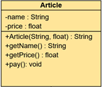
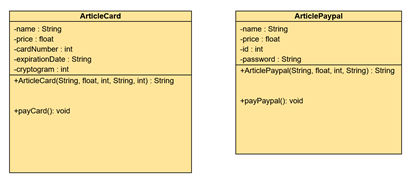

As explained in the [Design Patterns](../design-patterns/) article, the purpose is for your system to be ready for changes. If the logic is to coupled, this would cause hard work to implement something that would satisfy your customer request.  
This pattern is widely used in order to separate what may change in an application from what should stay the same.  
And it's also one of the simplest pattern to learn so let's get a grasp on what is design pattern.

# Theory - Use case

More detail on what I just said above

# Implementation - Example
## Bad implementation

Let’s say you work for Amazon, you are working on the backend, more specifically on the checkout part.  
You may have built an Article class looking like :  

The article has a name, a price and you can’t get this attributes or pay.  
However you could encounter a problem if you would like to give to the customer the opportunity to pay with different means (Credit card or Paypal).  
One way to fix this issue would be to use inheritence, by making the Article class abstract (and the pay method) and implementing:  

This implementation would work, the issue here is you would have to create the same amount of classes corresponding to each payment method with their own specificities. Besides, adding such things as expiration date or cryptogram not related to an Article is a bad practice.  

## Using the strategy pattern

# To conclude - The key takeaways
